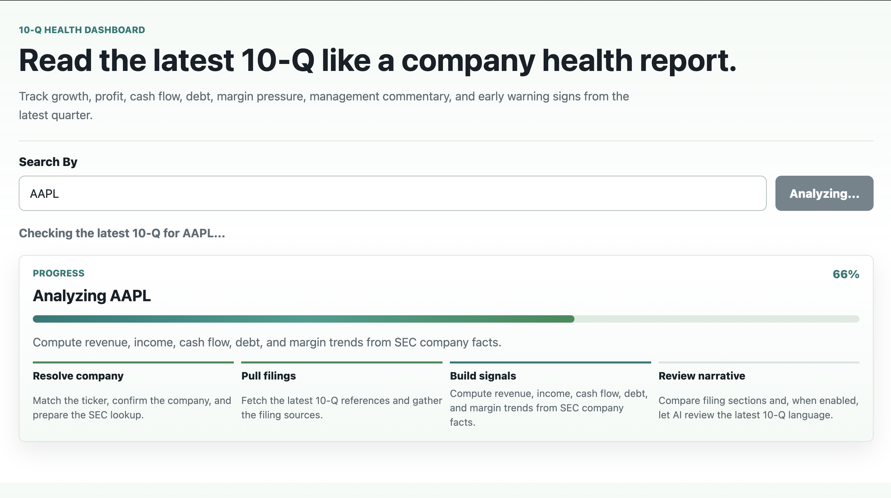
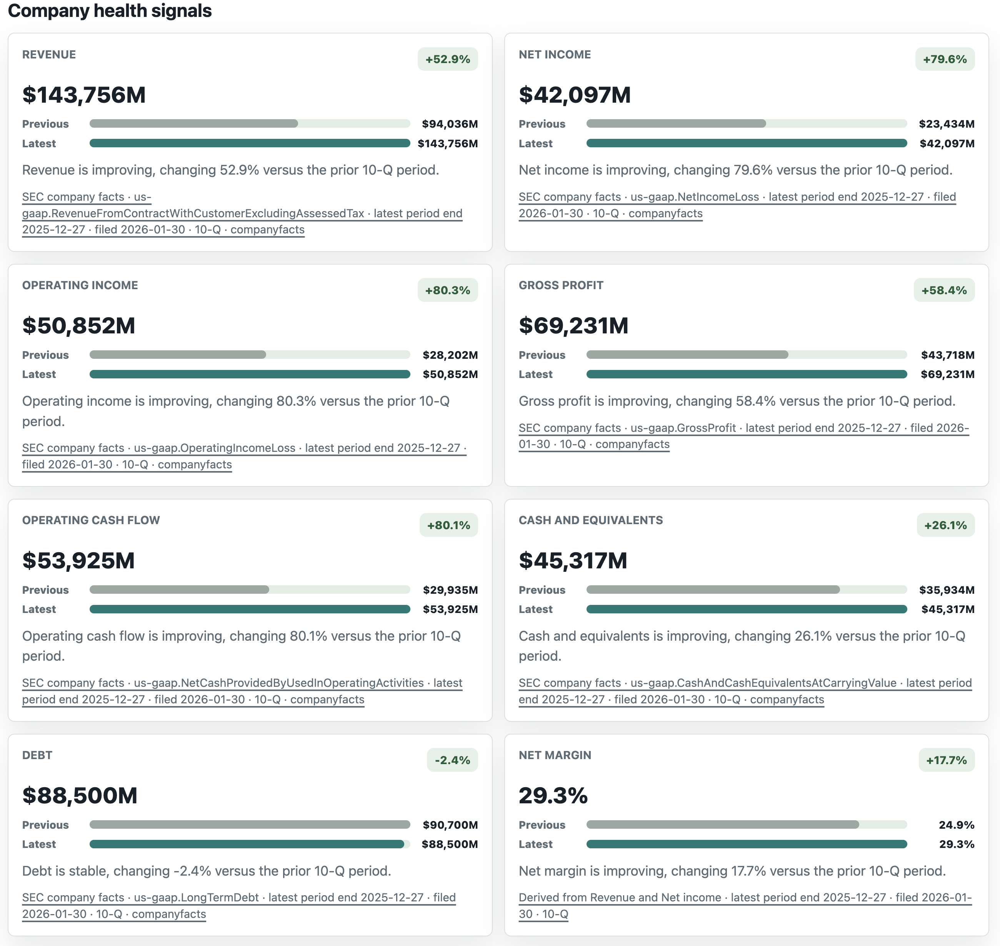

# SEC Filing Tracker

Rust/Axum backend and lightweight frontend for reading a company's latest 10-Q like a health report.

The app resolves a ticker to a SEC CIK, fetches recent SEC filing metadata, downloads the latest and previous 10-Q filings, pulls structured XBRL company facts, and presents financial trend signals alongside narrative section changes.

## What It Does

- Resolves ticker symbols to SEC CIKs.
- Finds the latest and previous 10-Q filings for a company.
- Downloads filing HTML documents from SEC EDGAR.
- Extracts narrative sections:
  - Risk Factors
  - Legal Proceedings
  - Management's Discussion and Analysis
- Fetches SEC XBRL company facts.
- Computes deterministic financial trend signals:
  - Revenue
  - Net income
  - Operating income
  - Gross profit
  - Operating cash flow
  - Cash and equivalents
  - Debt
  - Net margin
  - Operating margin
  - Gross margin
- Returns a rough company health score and warning signs.
- Serves a browser dashboard at `/`.

## Screenshots

Loading progress with staged analysis:



Company health signals with SEC company-facts provenance:



## Tech Stack

- Rust
- Axum
- Tokio
- Reqwest
- Serde / serde_json
- Scraper
- Regex
- Tracing
- Thiserror
- Plain HTML/CSS/JavaScript frontend served by Axum

## Running Locally

Install Rust if you do not already have it, then run the app from the repository root.

SEC requests must include a descriptive `User-Agent`. Set `SEC_USER_AGENT` before running the server:

```bash
SEC_USER_AGENT='sec-filing-health-dashboard/0.1 your-email@example.com' cargo run
```

Optional AI evidence can be enabled with an OpenAI API key. Without it, the app still returns deterministic scoring, score drivers, and filing excerpts.

```bash
OPENAI_API_KEY='sk-...' OPENAI_MODEL='gpt-4.1-mini' SEC_USER_AGENT='sec-filing-health-dashboard/0.1 your-email@example.com' cargo run
```

Then open:

```text
http://127.0.0.1:3000/
```

The server listens on `127.0.0.1:3000`.

You can confirm the backend is up with:

```bash
curl -sS http://127.0.0.1:3000/health
```

The ticker search and analysis endpoints fetch live SEC data, so keep the server running while using the browser dashboard.

## API Endpoints

### Health Check

```http
GET /health
```

Response:

```json
{
  "ok": true
}
```

### 10-Q Health Analysis

```http
GET /analyze/:ticker
```

Example:

```http
GET /analyze/AAPL
```

Returns:

- company and filing metadata
- latest and previous filing URLs
- overall health score
- financial trend metrics in USD millions or percent
- warning signs
- management/risk narrative notes
- section-level change scores

### Filing Section Comparison

```http
GET /compare/:ticker?form=10-Q
```

Example:

```http
GET /compare/AAPL?form=10-Q
```

Also supports `form=10-K`, though the current product focus is 10-Q health analysis.

## SEC Data Sources

Ticker to CIK mapping:

```text
https://www.sec.gov/files/company_tickers.json
```

Company submissions:

```text
https://data.sec.gov/submissions/CIK##########.json
```

Company XBRL facts:

```text
https://data.sec.gov/api/xbrl/companyfacts/CIK##########.json
```

Filing HTML documents:

```text
https://www.sec.gov/Archives/edgar/data/{cik_no_leading_zeros}/{accession_no_no_dashes}/{primary_document}
```

## Project Structure

```text
src/
  main.rs                # Server bootstrap
  routes.rs              # HTTP routes and response assembly
  models.rs              # API response and shared data models
  sec_client.rs          # SEC HTTP client, User-Agent, timeouts, pacing
  company_facts.rs       # SEC XBRL/companyfacts parsing helpers
  financial_metrics.rs   # Revenue, income, cash, debt, margin trend calculations
  filing_locator.rs      # Submissions filtering and filing URL construction
  filing_fetcher.rs      # Filing HTML download
  section_parser.rs      # Narrative section extraction
  diff.rs                # Section change scoring
  summarizer.rs          # Rule-based section summaries
  trend_analyzer.rs      # Overall health scoring
  warning_signs.rs       # Deterministic warning sign generation
  error.rs               # JSON error handling
  static/
    index.html
    styles.css
    app.js
```

## Current Limitations

This is a deterministic v1, not an AI analyst.

- Financial metrics depend on SEC XBRL tagging consistency.
- Period alignment still needs improvement for some companies.
- Narrative section extraction uses regex and heading heuristics.
- Summaries are rule-based and do not deeply understand business context.
- Warning signs are simple deterministic signals.
- Ticker mapping is fetched live on request; a TODO exists to cache it locally.

## Development

Run tests:

```bash
cargo test
```

Check frontend JavaScript syntax:

```bash
node --check src/static/app.js
```

Format Rust code:

```bash
cargo fmt
```

## Next Steps

- Cache `company_tickers.json` locally with a refresh TTL.
- Improve period alignment for quarterly vs year-to-date XBRL facts.
- Add better debt aggregation across current and non-current concepts.
- Add paragraph-level MD&A and risk-factor extraction.
- Add evidence snippets for warning signs.
- Consider AI summaries only after deterministic paragraph-level changes are identified.
